# ASKCOS 2021.01 Release Highlights

The open-source release of ASKCOS 2021.01 includes features from the original 2020.10 and 2021.01 releases developed
for the MLPDS consortium. This release contains many new machine learning models and user interface improvements.

# MCTS tree builder improvements

ASKCOS 2021.01 includes a new version of the MCTS tree builder. The v2 algorithm uses a graph-based data structure
and provides improved performance. The v2 tree builder also provides more flexibility for setting termination
conditions, including new settings for the number of iterations to run and the number of chemicals or reactions to
explore. The exploration behavior during tree expansion is slightly different between the two versions, and each
version may do better at finding routes than the other in certain cases. The tree builder version may be chosen in the
IPP settings panel before submitting a tree builder job.

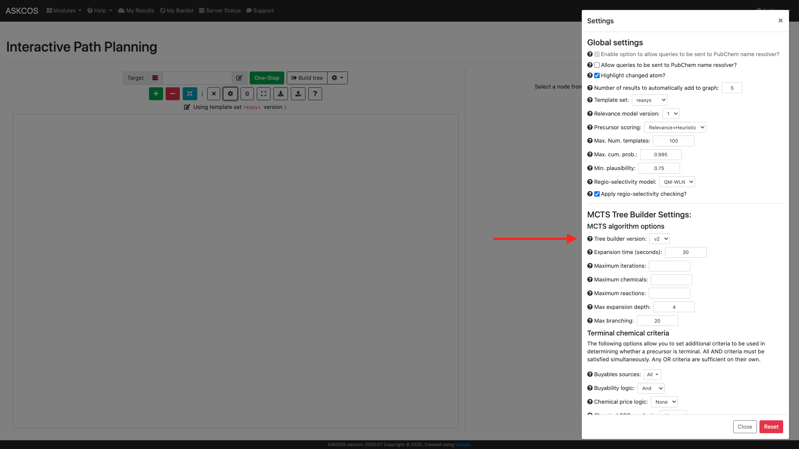

In addition, the pathway resolution algorithm was rewritten for both versions of the tree builder, providing over an
order of magnitude speed-up in returning pathways. The new algorithm also does a much better job of eliminating
pathways which include cycles and ones which exceed the maximum tree depth.

For both tree builder versions, the settings for terminal chemical criteria were refactored for more flexibility.
Specific buyables sources can now be selected to limit which molecules are considered buyable. This can also be used to
consider internally available building blocks which may not necessarily be buyable, by uploading them to the buyables
database with a descriptive source field. To aid this use, the buyability logic (i.e. existence of a chemical in the
buyables database) was separated from chemical price logic, to make it easier to disregard price as a factor. Finally,
SCScore has also been added as a termination criteria.

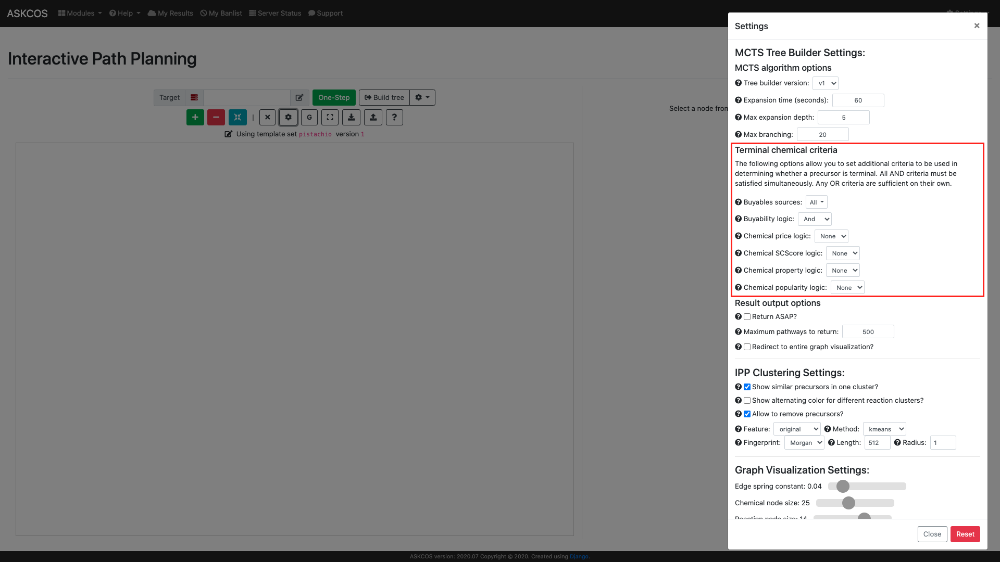

# Pathway ranking and clustering

This release also introduces pathway ranking and clustering capabilities, which are based on a tree-LSTM
(long short-term memory) model for encoding retrosynthetic trees. The pathway ranking model was trained to score
pathways in comparison to human-designed pathways from the Pistachio database, and this "Strategic quotient" is then
used to rank the pathways. The learned embeddings from the tree-LSTM model are also used to cluster the trees using
standard clustering algorithms, including hdbscan and kmeans.

Pathway ranking and clustering is available from a new API endpoint, `/api/v2/path-ranking/`, which accepts a list of
ASKCOS generated pathways encoded as a json string. In addition, pathway ranking and clustering is performed by default
for new tree builder jobs, which provides more convenient access to the functionality. The tree builder API endpoint
(`/api/v2/tree-builder/`) also provides some options for adjusting the clustering algorithm, which we plan to bring
to the user interface for the next release.

?>Mo, Y.; Guan, Y.; Verma, P.; Guo, J.; Fortunato, M. E.; Lu, Z.; Coley, C. W.; Jensen, K. F.
Evaluating and Clustering Retrosynthesis Pathways with Learned Strategy. Chem. Sci. 2021, 12 (4), 1469–1478. https://doi.org/10.1039/d0sc05078d.

# New tree results page

In order to make it easier to explore tree builder results including the new pathway clustering feature, the tree
results interface was overhauled to provide a more flexible viewing experience. The pathway display is now much larger
and oriented horizontally. Job settings and node details are now shown in small panels which can be moved around,
collapsed, minimized, maximized, and closed.

Individual pathways can be browsed through one-by-one like before, or the "View by cluster" option can be toggled,
enabling a second set of navigation buttons for browsing through the pathway clusters. Also, a new list view provides
a way to skim through multiple trees at once, before selecting one to view in detail in the main window.

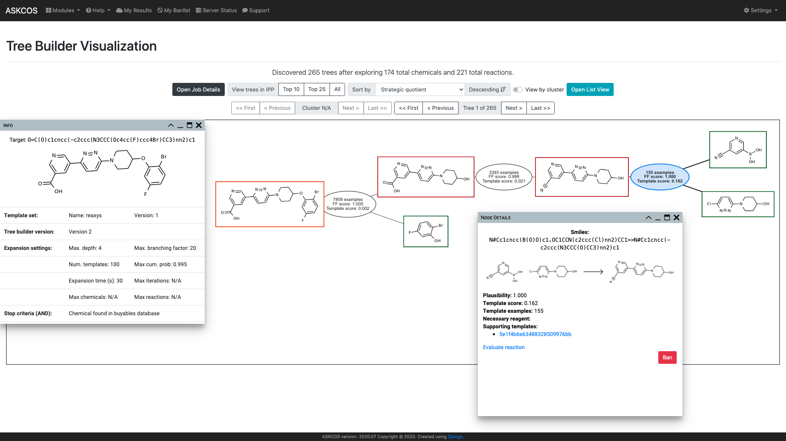

?>Currently, the list view will include all trees, or all trees in the current cluster if "View by cluster" is enabled.
Rendering these trees may be slow or require significant resource if there are many trees.

?>The "View by cluster" option is only available for tree builder jobs for which pathway ranking and clustering was
performed. There is currently no method for running pathway ranking and clustering for existing tree builder results,
but we plan to introduce that capability in a future release.

# QM reactivity descriptors and new regioselectivity model

We're also introducing a new model for predicting multiple QM descriptors for a molecule. The predicted descriptors
include partial charges, Fukui indices, NMR shielding constants, bond lengths, and bond orders. Currently, the model
can only be used via the new `/api/v2/descriptors/` API endpoint. We plan to introduce a user interface in the future
as well.

?>Descriptor results are returned as arrays where the order of values matches the atom and bond orders from using RDKit
to read in the input SMILES string with explicit hydrogens enabled.

QM descriptors are also used by the new universal regioselectivity model to improve prediction accuracy. Previously,
regioselectivity predictions were available from the IPP interface for reactions which were identified to have potential
selectivity issues. The new QM-based model is available from the IPP interface as well as a new regioselectivity
prediction tab in the Forward Synthesis Planner.

!>The QM descriptor model only supports C, H, O, N, P, S, F, Cl, Br, I, and B. As a result, the QM-based
regioselectivity model is also limited to the same set of elements.

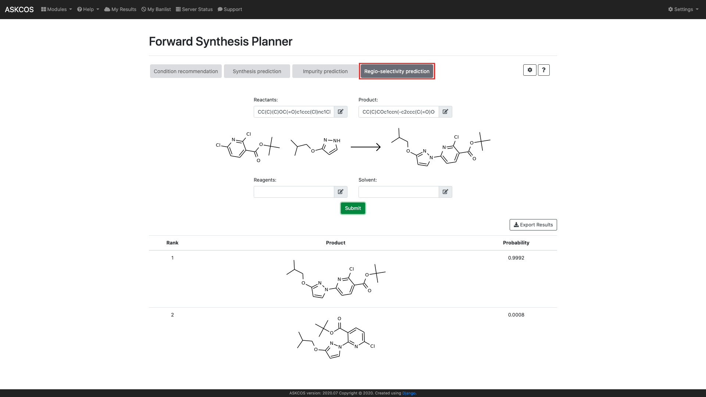

?>Guan, Y.; Coley, C. W.; Wu, H.; Ranasinghe, D.; Heid, E.; Struble, T. J.; Pattanaik, L.; Green, W. H.; Jensen, K. F.
Regio-Selectivity Prediction with a Machine-Learned Reaction Representation and on-the-Fly Quantum Mechanical Descriptors. Chem. Sci. 2021, 12 (6), 2198–2208. https://doi.org/10.1039/d0sc04823b.

# Solvent scoring for green chemistry

The condition recommender now displays solvent scores for each of the recommendations indicating how green a solvent is,
based on a combination of environmental, health, and safety considerations. A score of 1 is best, and a score of 6 
indicates very hazardous. The scores are determined using a database of scores for commonly used solvents compiled by
[Byrne et al.](https://doi.org/10.1186/s40508-016-0051-z) Solvents not found in the database are assigned a score of 7.

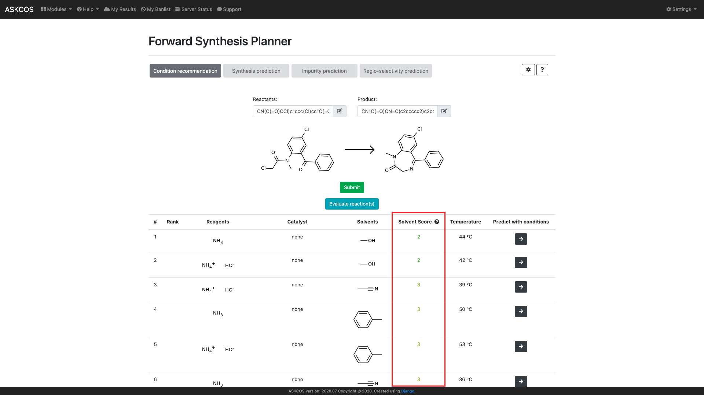

# Pistachio template set and template attribute filtering

This release also includes a new template relevance model trained on Pistachio reactions, providing an alternative
to the current Reaxys model. The new Pistachio template set also comes with template attributes which are pre-computed
based on the reaction precedents for each template. Currently, the two available attributes are `ring_delta` and
`chiral_delta`, which represent the average change in number of rings or chiral centers of the reaction precedents.

These attributes can be used to filter the templates before they are applied to the target molecule. This allows
predictions to be targeted towards transformations which achieve the desired changes to the molecule. Since templates
are filtered before they are applied to the target molecule, this can also reduce the prediction time, allowing for
larger values to be chosen for the maximum number of templates and maximum cumulative probability.

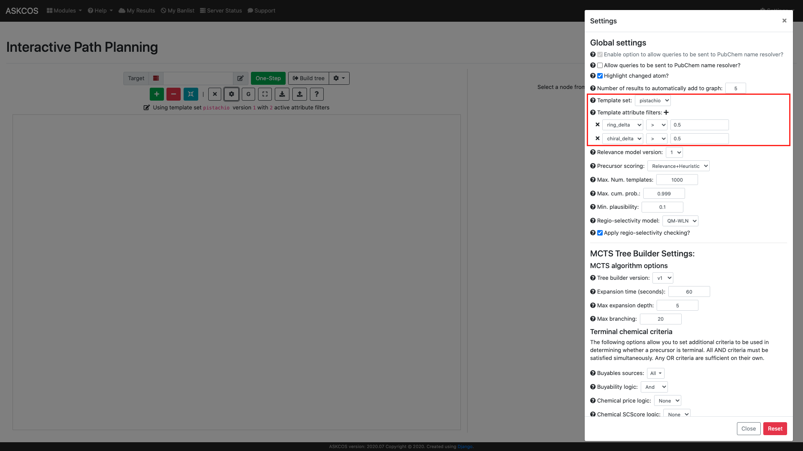

# Quantitative reaction condition recommender (Neural Network v2)

The new reaction condition recommendation model included in ASKCOS 2021.01 differs from the existing model primarily in its
ability to predict quantitites of reactants and reagents. There are two sub-versions of the model, trained on the same set of
data from Pistachio 2019-11-18: a graph model and a fingerprint model. The two models have very similar accuracies,
with the primary difference (from a user perspective) being that the graph model requires an atom-mapped reaction SMILES as input.
The trade-off with the fingerprint model is that it's much larger and requires slightly longer prediction times. Thus,
if atom-mappings are available, we recommend using the graph model. However, the fingerprint model is currently set as the
default due to its convenience.

The new model can be accessed from the same condition recommendation tab in the forward synthesis planner as before
by opening the settings dialog and changing the model selection to `Neural Network V2 (Quantity Prediction)`.

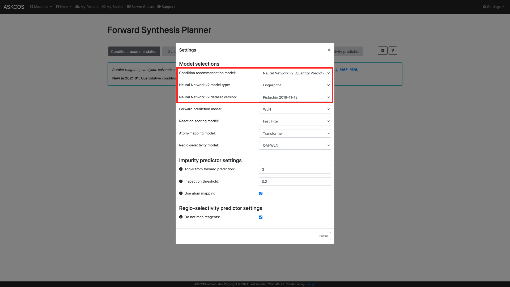

We are also working on streamlining a model-retraining pipeline for this condition recommendation model, which we hope
to release in the coming months.

# Interactive filtering by reacting atoms

In the IPP, we have replaced the old molecule drawing app with Ketcher, which not only provides a nicer interface, but
also expanded visualization capabilities.

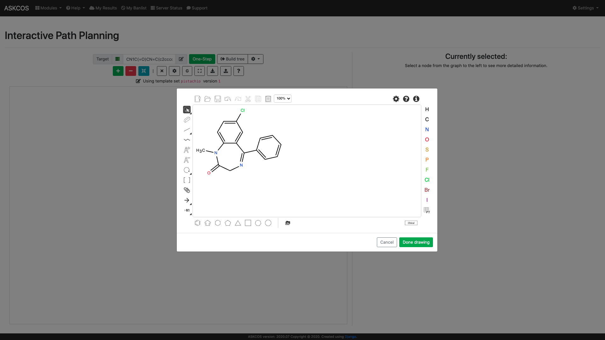

As one of the first steps in leveraging the additional interactivity provided by Ketcher, we have implemented
a simple feature to filter IPP results by reacting atoms. The molecule image in the node detail panel on the right side
of the IPP interface is now interactive, and allows selection of atoms in the molecule. A new option to
"Filter for reacting atoms" will only display the precursor results in which one of the selected atoms is part of the
reaction. The list of precursors will update automatically as changes are made to the selected atoms.

?>Although bond selections are also possible in Ketcher, they are currently not taken into account for the filter.
To view precursors which break a bond, try selecting one or both of the atoms in the bond. Multiple atoms can be
selected by holding shift or dragging a circle around the desired atoms.

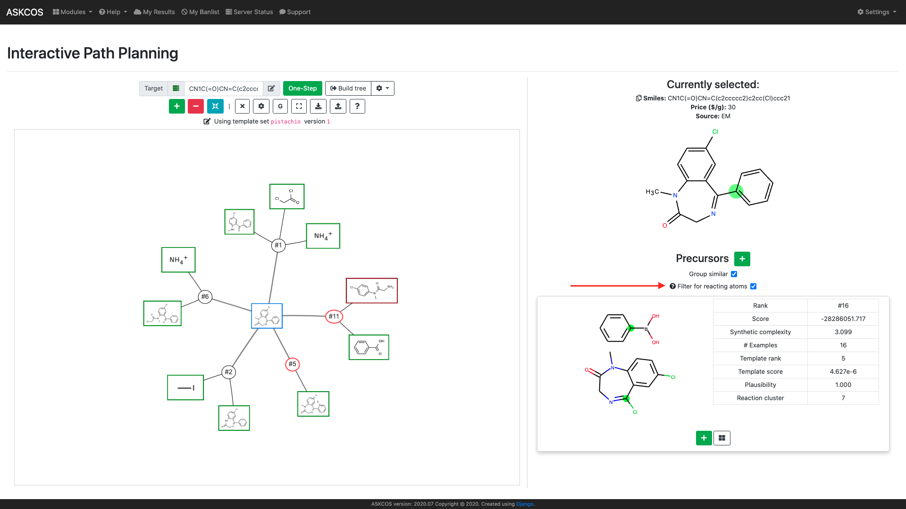

# View recommended templates in IPP

One new feature added to the IPP is the ability to view all recommended retrosynthetic templates for a target molecule. The recommended
templates can be viewed using the link in the info panel on the right side of the screen.

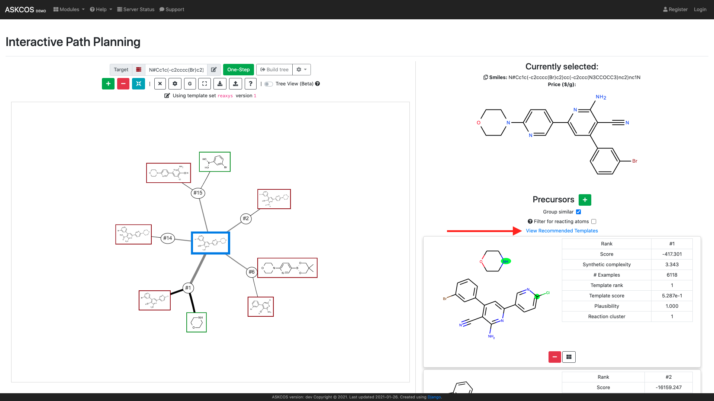

Once opened, a modal is displayed which shows all of the templates which were recommended for the selected target molecule,
including those which failed to generate precursors. This can provide some additional insight into the underlying retrosynthetic
template relevance model.

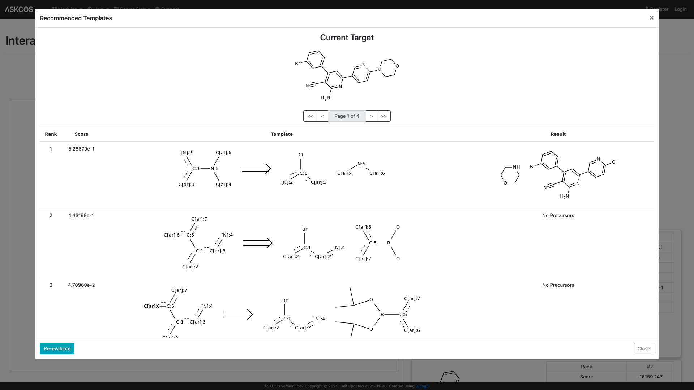

?> The recommended templates modal can also be opened for un-expanded nodes. However, clicking the "Apply Template"
button currently does not update the precursors view with the generated result.

# Tree view in IPP

ASKCOS 2021.01 included a significant refactor of the underlying code for the IPP, switching to a more straightforward
graph data structure. The new data structure facilitates the implementation of graph algorithms for exploring and
analyzing the retrosynthetic tree.

One of the initial features we're bringing to the IPP is the enumeration of individual retrosynthetic pathways from the
larger retrosynthetic tree. Activating the "Tree View" will highlight individual pathways in the tree and provide some
basic statistics for each.

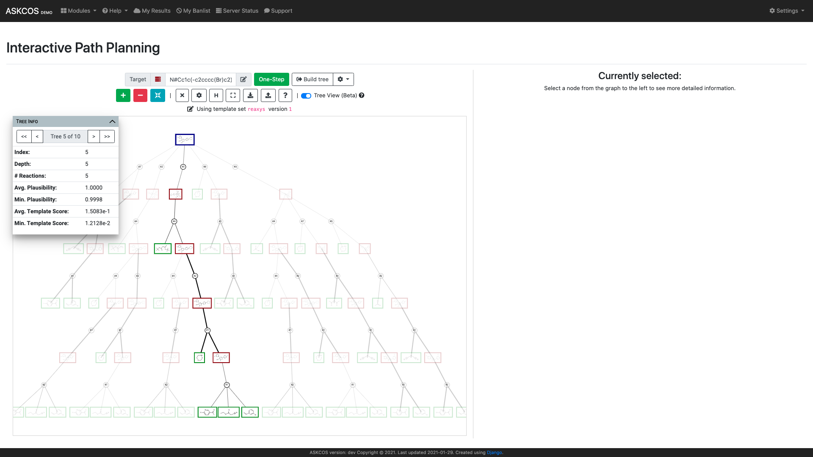

?> Currently, the pathway resolution algorithm does not reflect the tree builder terminal criteria options in the
settings dialog. However, we plan to add that feature in an upcoming release.

# New home page single-entry point

The ASKCOS home page now features an interactive single-entry point which provides quick actions to either perform simple
tasks right from the home page or direct you to the correct page for a particular task.

By entering a molecule SMILES into the search bar, various options are displayed, such as evaluation of the molecule's
SC-Score, a link to synthesize the molecule in the IPP, or a button to submit a tree builder job using the default settings.

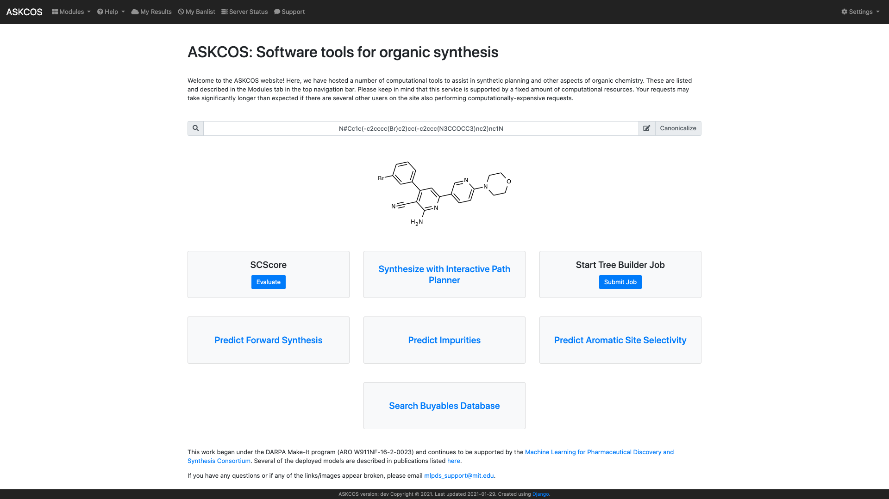

If a reaction SMILES is entered, additional options are presented, including the ability to atom map the reaction right
from the home page, or go to the forward synthesis planning page to predict reaction conditions or impurities.

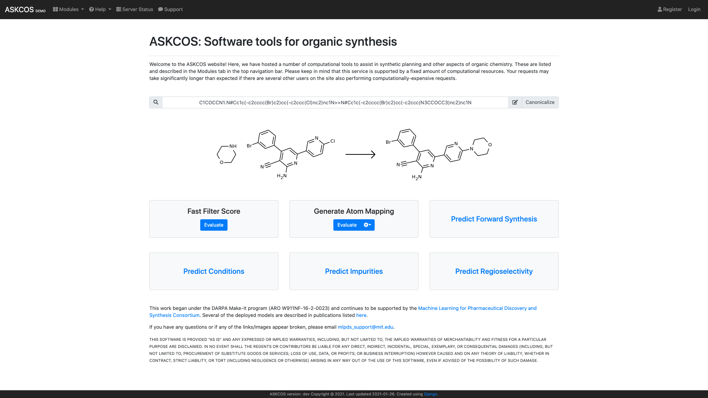

# Updated aromatic C-H site selectivity interface

The aromatic C-H site selectivity model has received a redesigned interface in this release, and can now be accessed
in a new tab in the forward synthesis planner. The new interface also includes a search bar which can be used to
quickly filter through the 123 C-H functionalization reactions which the model is trained for.

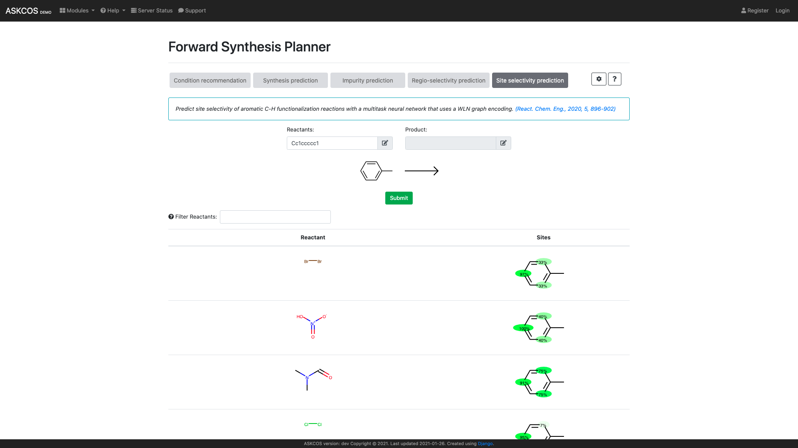

# Celery task priority

In this release, we made some modifications to allow for celery task priority. Currently, the option to set task
priority has been added to the `/retro/`, `/tree-builder/`, `/forward/`, and `/atom-mapper/` API v2 endpoints.

Three priority levels are available: 0 (low priority), 1 (normal priority), and 2 (high priority). Celery
tasks initiated by the web interface have normal priority by default. This allows tasks submitted directly via the API
to have either a higher or lower priority than web tasks.

Note that this implementation is for task priorities, in contrast to queue priorities. Each of these endpoints has a
single queue to which all tasks are added. The tasks in the queue are regularly sorted based on the assigned task
priorities. However, depending on the number of tasks in the queue and how long each task takes, it's possible that a
high-priority task may reach the front of the queue naturally before it can be sorted to the front.

As a practical example, say 100 normal-priority tasks are submitted to the `/retro/` endpoint, followed by one
high-priority task. The `/retro/` endpoint is processed by `tb_c_worker`, which has a default concurrency of 12.
In testing, the `tb_c_worker` processed 30-40 of the normal-priority tasks before the queue was able to sort the
remaining tasks, which brought the high-priority task to the front. For tree builder tasks, which have fewer workers
and longer task durations, not as many tasks would be processed before queue sorting occurs.
